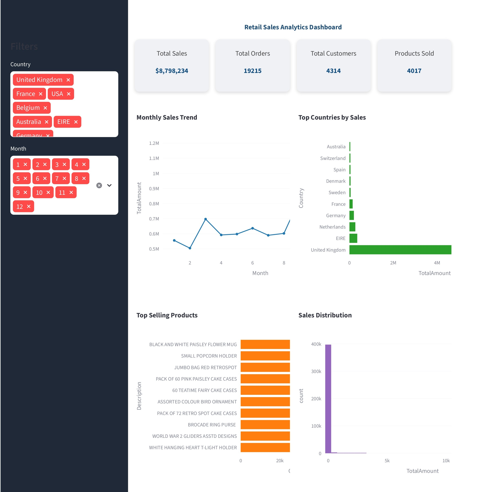

# 🛍️ Retail Data Engineering Pipeline with Analytics Dashboard


---

# 📌 Project Overview

This project demonstrates a complete **Retail Data Engineering Pipeline** built using **Python**.
The system processes large retail transaction datasets, performs **data cleaning**, **feature engineering**, **data analysis**, and **machine learning modeling**, and presents insights through an **interactive analytics dashboard**.

The dashboard allows users to explore **sales performance, product trends, and customer insights** using interactive visualizations.

The dataset contains **500,000+ retail transactions**, simulating real-world retail analytics scenarios.

---

# Dataset

The project uses a retail transactions dataset containing over 500,000 records.

Key columns include:

InvoiceNo – unique transaction ID  
StockCode – product ID  
Description – product name  
Quantity – number of items purchased  
InvoiceDate – transaction date  
UnitPrice – price per product  
CustomerID – unique customer ID  
Country – customer country


# 🏗️ Project Architecture

Retail Dataset (CSV)
↓
Data Ingestion
↓
Data Cleaning
↓
Feature Engineering
↓
Database Storage
↓
Data Analysis
↓
Machine Learning Models
↓
Streamlit Analytics Dashboard

---

# 📂 Project Structure

```
retail-data-engineering-pipeline
│
├── data
│   └── transformed_retail.csv
│
├── scripts
│   ├── ingest_data.py
│   ├── clean_data.py
│   ├── feature_engineering.py
│   ├── database_load.py
│   ├── data_analysis.py
│   ├── data_visualization.py
│   ├── ml_models.py
│   └── pipeline.py
│
├── dashboard.py
├── requirements.txt
├── README.md
└── .gitignore
```

---

# ⚙️ Data Engineering Pipeline

The project includes several pipeline stages:

## 1️⃣ Data Ingestion

Load the raw retail dataset from CSV files.

## 2️⃣ Data Cleaning

* Handle missing values
* Remove invalid transactions
* Standardize data formats

## 3️⃣ Feature Engineering

New features are generated to improve analytical insights:

* `TotalAmount`
* Extract **Month** from invoice date
* Generate additional analytical features

## 4️⃣ Database Storage

Processed data can be stored in a database for scalable analytics and future queries.

## 5️⃣ Data Analysis

Business insights explored include:

* Monthly sales trends
* Top performing countries
* Product demand analysis
* Customer purchase activity

## 6️⃣ Machine Learning Models

Several machine learning models are trained to analyze sales patterns:

* Linear Regression
* Decision Tree
* Random Forest
* Support Vector Machine
* Naive Bayes (Sales category classification)

---

# 📊 Analytics Dashboard

The project includes an **interactive analytics dashboard** built using **Streamlit and Plotly**.

## Dashboard Features

* KPI metrics for business performance
* Country-based filtering
* Month-based filtering
* Monthly sales trend visualization
* Top selling products analysis
* Country-wise sales analysis
* Sales distribution insights
* Interactive charts with zoom and hover functionality

All visualizations update dynamically based on filter selections.

---

# 🖥️ Dashboard Preview

*(Add screenshot in images folder)*

```
images/dashboard.png
```

Then display:



---

# 🚀 Installation

Clone the repository:

```
git clone https://github.com/Srikarsaitej/retail-data-engineering-pipeline.git
```

Move into the project directory:

```
cd retail-data-engineering-pipeline
```

Install required dependencies:

```
pip install -r requirements.txt
```

---

# ▶️ Run the Data Pipeline

Execute the full ETL pipeline:

```
python scripts/pipeline.py
```

---

# 📊 Run the Dashboard

Start the Streamlit dashboard:

```
streamlit run dashboard.py
```

Open in browser:

```
http://localhost:8501
```

---

# 🛠️ Technologies Used

* Python
* Pandas
* NumPy
* Matplotlib
* Seaborn
* Scikit-Learn
* Streamlit
* Plotly
* Git
* GitHub

---

# ⭐ Key Highlights

* End-to-end **Data Engineering Pipeline**
* **Machine Learning integration for retail analytics**
* **Interactive analytics dashboard**
* Real-time filtering and visualization
* Modular and scalable project architecture

---

# 🔮 Future Improvements

Potential improvements to enhance the system:

* Integrate **SQL / PostgreSQL database**
* Add **Apache Airflow pipeline automation**
* Deploy dashboard using **Streamlit Cloud**
* Add **real-time data ingestion**
* Implement **advanced ML forecasting models**

---

# 👨‍💻 Author

**Srikar Sai Tej**

GitHub:
https://github.com/Srikarsaitej

---

# 📜 License

This project is developed for **educational and portfolio purposes**.
